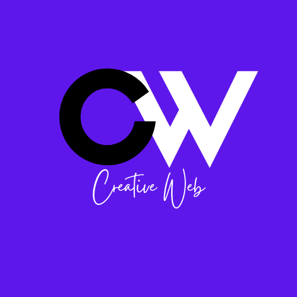

  

  <b>Websites · Mobile Apps · ERP Systems · Payments</b> 
  Transforming ideas into digital experiences.

  <a href="https://creative-web.chellahtrey.workers.dev/#/">Visit the website</a> ·
  <a href="https://wa.me/260571919051">WhatsApp</a> ·
  <a href="mailto:suwilanjichellah0228@gmail.com">Email</a>

---

## Who we are

CreativeWeb is a digital studio founded by **Suwilanji Trey Chellah**. We design and build the things a modern business runs on: the website customers find you through, the app they use, the system that runs your operations, and the payments that get you paid.

You work directly with the person building your project, from the first conversation to launch. There are no account managers in between and no hand-offs.

**At a glance:** 50+ projects delivered · 30+ clients · 99% client satisfaction

## What we provide

### Build

| Service | What you get |
|---|---|
| **Websites** | Fast, responsive, accessible sites that are SEO-ready and built to turn visitors into customers. Custom designs or ready-made templates. |
| **Mobile apps** | iOS and Android apps that feel native and scale with your users. |
| **ERP and business systems** | Inventory, invoicing and billing, HR and payroll, reports and dashboards, all in one system built around how your business actually works. |
| **Branding and logo design** | Logos, colour systems and brand style guides, delivered in vector formats. |
| **Web services and integrations** | Custom email domains, CRM integration, API development, cloud databases and email marketing. |

### Get paid: YatuMobile

**YatuMobile** is our payment gateway for businesses and developers, built by the same team that builds your website so it fits in from day one.

> **Status:** in development, with early access available. On the roadmap: blockchain payments.
> If you would like to integrate YatuMobile into your product or be among the first to try it, [get in touch](#contact).

### Ready-made templates

Launch faster with a template you can preview live: Agency Landing Page, Real Estate, Football Fan / Manager, E-Commerce Platform, Startup Landing Page and Portfolio Website. All are responsive and customisable, and are built with light and dark mode.

## How we work

1. **Talk:** tell us what you need over WhatsApp or email. We reply within 24 hours.
2. **Plan:** we agree on scope, timeline and budget before any work starts.
3. **Build:** you work directly with the developer throughout, and you see progress as it happens.
4. **Launch and support:** we deliver to modern standards and stay on hand after launch.

## Contact

| | |
|---|---|
| **WhatsApp** | [+260 57 191 9051](https://wa.me/260571919051) (fastest reply) |
| **Email** | [suwilanjichellah0228@gmail.com](mailto:suwilanjichellah0228@gmail.com) |
| **LinkedIn** | [Suwilanji Chellah](https://www.linkedin.com/in/suwilanji-chellah-01a534239) |
| **Website** | [creative-web.chellahtrey.workers.dev](https://creative-web.chellahtrey.workers.dev/#/) |
| **Portfolio** | [suwilanjitreychellah.vercel.app](https://suwilanjitreychellah.vercel.app/) |
<!-- TODO: add the YatuMobile URL as a row once its page is public -->

---

Developers: setup notes, the design system and the current to-do list are in [DEVELOPMENT.md](DEVELOPMENT.md). Release history is in [CHANGELOG.md](CHANGELOG.md).
